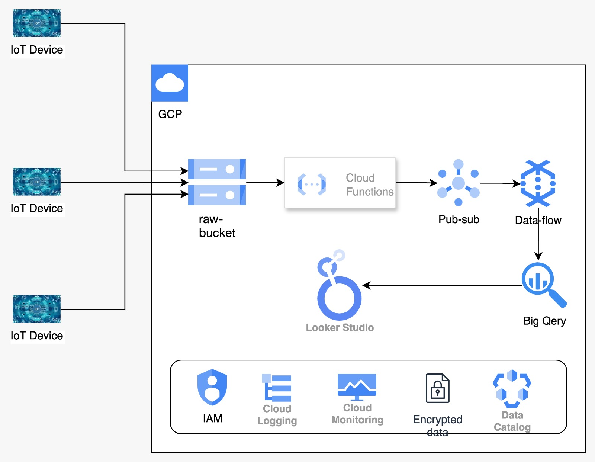

# Scalable Serverless Data Lake for Real-Time Analytics (GCP)

## 🌟 Objective
Build a fully serverless data lake on Google Cloud Platform to ingest, store, process, and query real-time IoT sensor data using Cloud Functions, Cloud Storage, Dataflow, and BigQuery.

## 🚀 Architecture


## 🔧 Project Components
- **Cloud Function**: Publish CSV row from storage to pub/sub
- **Cloud Storage**: Central durable data lake
- **Dataflow**: Transforms and loads data to BigQuery
- **BigQuery**: Runs analytics and reports
- **LookerStudion**: Analysis the data based on business need

## 📂 Folder Structure
(see above)

## 🏁 Getting Started
```bash
bash scripts/setup-gcs.sh
gcloud functions deploy ...
python3 dataflow-job/dataflow_job.py ...


# To test the pipeline, command to copy file from local system to google cloud storage
gsutil cp ~/Downloads/traffic_data/traffic_data.csv gs://traffic-data-raw-bucket/

#Creating subscriber to test published message
gcloud pubsub subscriptions create traffic-data-sub --topic=traffic-data-topic

#printing topic message in terminal
gcloud pubsub subscriptions pull traffic-data-sub --limit=5 --auto-ack
